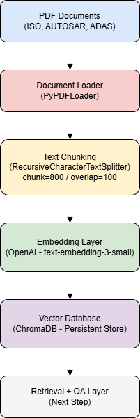

# 🚀 Retrieval-Augmented Generation (RAG) Pipeline for Domain-Specific Knowledge Systems

A practical implementation of a RAG pipeline for querying engineering documents (ISO 26262, AUTOSAR, ADAS) using LangChain, OpenAI embeddings, and ChromaDB.

---

## 🧩 Problem Statement

Modern engineering organizations generate vast amounts of unstructured knowledge across standards, specifications, and technical documentation (e.g., ISO 26262, AUTOSAR, ADAS design docs).

While this information is critical, it is often:

- ❌ Difficult to search efficiently  
- ❌ Spread across multiple PDF documents  
- ❌ Lacking semantic retrieval capabilities  
- ❌ Not easily consumable during development workflows  

Traditional keyword-based search fails to capture **context, intent, and semantic meaning**.

👉 The goal of this project is to build a **Retrieval-Augmented Generation (RAG) pipeline** that enables:

- Natural language querying of technical documents  
- Context-aware retrieval of relevant knowledge  
- Traceable answers grounded in source documents  

## 🏗️ System Architecture

The pipeline follows a standard RAG architecture:

## 📂 Project Structure

rag-pipeline-project/
│
├── ingest.py            # Ingestion pipeline (load → chunk → embed → store)
├── requirements.txt     # Project dependencies
├── docs/                # Source PDFs
│   ├── *.pdf

---

## ⚙️ Key Implementation Details

### 📄 Document Processing

- PDF ingestion via `PyPDFLoader`  
- Page-level metadata preserved (source + page number)  

---

### ✂️ Chunking Strategy

- `chunk_size = 800`  
- `chunk_overlap = 100`  

👉 **Trade-off:**

- Large enough for context  
- Small enough for precise retrieval  

---

### 🔍 Embeddings

- Model: `text-embedding-3-small`  

**Optimized for:**

- Cost efficiency  
- Fast inference  
- High semantic quality for technical text  

---

### 🗄️ Vector Storage

- Backend: **ChromaDB (local persistent store)**  

**Enables:**

- Fast similarity search  
- Incremental indexing  
- Local offline usage  

---

## 📊 Evaluation (Initial Observations)

Although this is an early-stage pipeline, qualitative evaluation shows:

---

### ✅ Retrieval Quality

- Relevant chunks retrieved even for **paraphrased queries**  

**Works well for:**

- Functional safety concepts  
- Architecture-level questions  
- System behavior descriptions  

---

### ✅ Strengths

- Semantic understanding (vs keyword search)  
- Robust to query phrasing  
- Grounded in source documents  

---

### ⚠️ Limitations

- Chunk-level granularity may:
  - Miss cross-section context  
  - Return partially relevant results  

- No reranking / hybrid retrieval yet  
- No formal evaluation metrics (e.g., RAGAS) yet  
